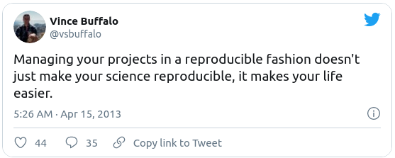
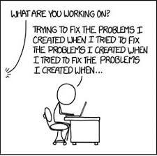
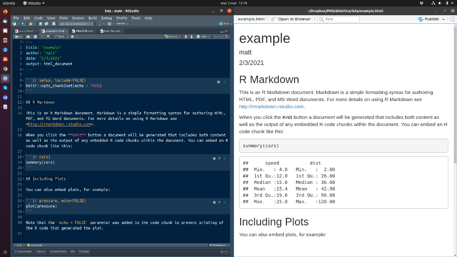

```{r setup, include=FALSE}
knitr::opts_chunk$set(echo = FALSE)
```

## What is reproducibility? ([Wiki](https://en.wikipedia.org/wiki/Reproducibility))

* Reproducibility means that a result obtained by an experiment or observational study should be achieved again when the study is replicated with the same methodology by different researchers

* Scientific results should be documented in such a way that their deduction is fully transparent

  - This requires a detailed description of the methods used to obtain the data and making the full dataset and the code to calculate the results easily accessible
  
* **This workflow is the essential part of open science**

## Who cares about reproducible research?

There are two basic reasons to be concerned about making your research reproducible

* **Show evidence of the correctness of your results**
A reproducible workflow make the decisions we made as we generated our results clear. This makes it easier for others to check whether our results are reliable (or not, since *reproducibility is no guarantee of correctness*)


<!--Descriptions contained in scholarly publications are rarely sufficient to convince sceptical readers of the reliability of our work. In simpler times, scholarly publications showed the reader most of the work involved in getting the result. The reader could make an informed choice about the credibility of the science. Now, the reader may feel they are being asked to blindly trust in all the details that were not described in the original journal article.
--->

* **Enable others (including the *future you*) to make use of your methods and results** Equipped with only our results, others might struggle to reconstruct our method in enough detail to apply it to their own data. 

<!--Adopting a reproducible workflow means publishing our code and data in order to allow our colleagues to extend our approach to new applications with a minimum of effort. This has the potential to save a great deal of time in transmitting knowledge to future researchers.
--->

## Reproducibility is hard!

Four steps towards it:

* Create portable objects (e.g. RStudio Projects)
  
  

* automate analysis (e.g. stop clicking and start typing), dynamic report & code documentation 
  
  

* Version control using `git` & GitHub
  
   

## Half joking
[Reproducible workflow: a trailer!](https://www.youtube.com/watch?v=s3JldKoA0zw&ab_channel=bartomeuslab)

> Let us change our traditional attitude to the construction of programs: Instead of imagining that our main task is to instruct a computer what to do, let us concentrate rather on explaining to humans what we want the computer to do.
>
> `r tufte::quote_footer('--- Donald E. Knuth, Literate Programming, 1984')`

## RStudio Projects / 1

* The scientific process is naturally incremental, and naturally gets messy
  
   
  
## RStudio Projects / 2

* Downsides are apparent:

  - you can not distinguish modified vs original data
  - it mixes files with various extensions 
  - it will take you a lot of time to actually find things


* We would like instead

  - to ensure the integrity of our data
  - to easily upload our code with our manuscript
  - to easily pick the project back up after a break
  
* What we need is a self-contained **project layout**, ensuring integrity and reproducibility

## Creating a self-contained project 

We're going to create a new project in RStudio:

> 1. Click the `File` menu button, then `New Project`
> 2. Click `New Directory`
> 3. Click `New Project`
> 4. Type in the name of the directory to store your project, e.g. `my_project`
> 5. Click the `Create Project` button

* 
<!--
> 1. Exit RStudio.
> 2. Navigate to the directory where you created the project
> 3. Double click on the `.Rproj` file in that directory.
-->

## "Best" practices for project organization / 1

### data as read only & data cleaning

* working with data interactively (e.g., in Excel) means that you don't keep track of changes
* treat your data as **read-only**

* data are *dirty* and need preprocessing to get into a format suitable for R (*data munging* or *data wrangling*)

* > **TIP**:
  > storing these scripts in a separate folder, and creating a second *read-only* data folder to hold the *cleaned* data sets can prevent confusion between the two sets

## "Best" practices for project organization / 2

### output as disposable & separate functions

* anything generated by your scripts should be treated as disposable: it should
all be able to be regenerated from your scripts
* separate `.R` files in functions files and script files

## THE ONLY RULE



* he didn't comment his code

* **COMMENT YOUR CODE!**

## What is & Why use R Markdown?

* R Markdown allows you to write documents that combine written text with analytical code

* it is based on Markdown so the text in the document can be fully formatted

* you can choose to make your code visible or not

* documents' output can be PDF, Word Documents, HTML

* documents with embedded code are reproducible

  - the document will serve as a record for how you arrived at the results
  - You can pass on your code to readers in addition to the report content
  - documents change seamlessly as data are updated

<!--
 Example

As an example we can embed the following code in the text. It is often useful to comment or discuss the code in a report. We first show the code

```{r eval=FALSE, echo = TRUE}
  install.packages(c("knitr","rmarkdown"))
```

and then we say that we run this line  in order to install packages knitr and rmarkdown, that are needed for document creation.

 Let's start

To create an R Markdown document simply:

> 1. Open RStudio
> 2. Select `File -> New File -> R Markdown`
> 3. Enter `Title`, `Author`, and `Output Format` (this can be changed later)
> 4. Hit `OK` button

You will get an example that you can alter or delete
-->

## R Markdown components



## R Markdown components / YAML

```{r eval=FALSE, echo = TRUE}
---
title: "example"
author: "Matteo Pedone"
date: "`r Sys.Date()`"
output: html_document
---
```

* Stands for *YAML Ain't Markup Language*
* The initial chunk of text contains instructions for R
* for pdf output only $\LaTeX$ packages can be uploaded

## R Markdown components / YAML

```{r eval=FALSE, echo = TRUE}
---
title: "example"
author: "Matteo Pedone"
date: "`r Sys.Date()`"
output: 
  pdf_document:
    extra_dependencies: ["bbm", "threeparttable"]
---
```

* for more [detail](https://bookdown.org/yihui/rmarkdown-cookbook/latex-extra.html)

## R Markdown components / Formatted text

[Markdown](https://daringfireball.net/projects/markdown/) is a powerful, lightweight and easy-to-use syntax to style text on the web 

```{eval=FALSE, echo=TRUE}
It's very easy to make some words **bold** and ~~oter~~ other words *italic* with Markdown. 
You can even [link to Google!](http://google.com)
You can write equations in $\LaTeX$, too
$$y = \mu + \sum_{i=1}^p \beta_i x_i + \epsilon$$
```
It's very easy to make some words **bold** and ~~oter~~ other words *italic* with Markdown. You can even [link to Google!](http://google.com)
You can write equations in $\LaTeX$, too
$$y = \mu + \sum_{i=1}^p \beta_i x_i + \epsilon$$
For a quick way to [master Markdown](https://guides.github.com/features/mastering-markdown/)

## R Markdown components / chunks 1

* Code chunks are where the magic happens in R Markdown

* The code you enter **within the text** gets executed and the results are shown in the document 

* This sort of idea has been called *"literate programming"*

* Ideally, such analysis reports are reproducible documents: If an error is discovered, or if some additional subjects are added to the data, you can just re-compile the report and get the new or corrected results 

## R Markdown components / chunks 2

* The key tool for R is `knitr`, which allows you to create a document that is a mixture of text and some chunks of code. 

* When the document is processed by knitr, chunks of R code will be executed, and graphs or other results inserted.

*  

<!--
When you press the “Knit HTML” button, the R Markdown document is processed by knitr and a plain Markdown document is produced (as well as, potentially, a set of figure files): the R code is executed and replaced by both the input and the output; if figures are produced, links to those figures are included.

The Markdown and figure documents are then processed by the tool pandoc, which converts the Markdown file into an html file, with the figures embedded.
-->

## Example

When you **Knit** the document will be generated that includes both content as 
well as the output of any embedded R code chunks within the document. You can 
embed an R code chunk like this:
<pre>
&#96;&#96;&#96;{r descriptive, echo=TRUE}
  summary(cars)
  plot(pressure)
&#96;&#96;&#96;
</pre>

Note that the `echo = TRUE` parameter was added to the code chunk to print the R code that generated the table and the plot.

## Example 2

```{r, echo=TRUE}
  summary(cars)
```

## Example 3
```{r, echo=TRUE}
  plot(pressure)
```

## Chunk options

* There are a variety of options to affect how the code chunks are treated.

  - use `echo=FALSE` to avoid having the code itself shown
  - use `results="hide"` to avoid having any results printed
  - use `eval=FALSE` to have the code shown but not evaluated
  - use `warning=FALSE` and `message=FALSE` to hide any warnings or messages produced
  - use `fig.height` and `fig.width` to control the size of the figures produced (in inches)
