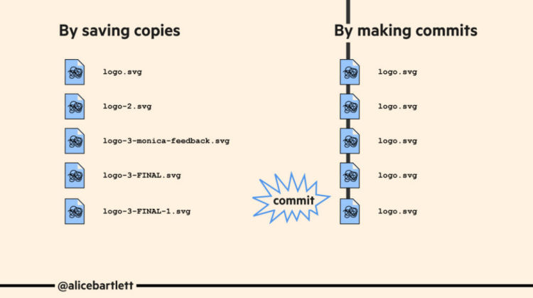
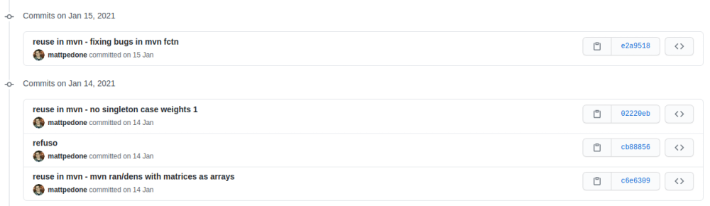
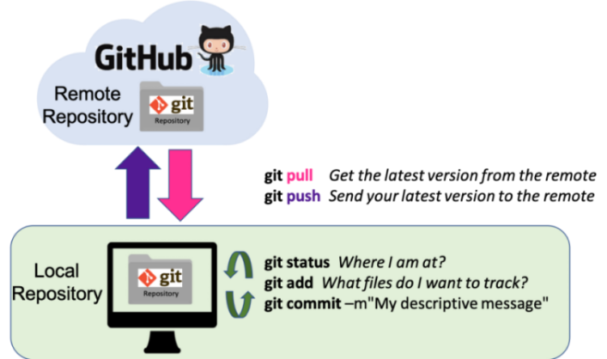

```{r fundef, echo = FALSE}
colorize <- function(x, color) {
  if (knitr::is_latex_output()) {
    sprintf("\\textcolor{%s}{%s}", color, x)
  } else if (knitr::is_html_output()) {
    sprintf("<span style='color: %s;'>%s</span>", color, 
      x)
  } else x
}
```

## What is Version Control?

> Version control is a time machine for code
> `r tufte::quote_footer('--- Anonymous')`
<br>

* it is a tool for software development

* it is useful to work on the source code and documents **safely**

* creates a timeline of snapshots containing different versions of a file

* why use it?

## Do we really need it?

<center>
 
</center>
 
## And what is Git?

> I'm an egotistical bastard, and I name all my projects after myself. First 'Linux', now 'git'.
> `r tufte::quote_footer('--- Linus Torvalds')`
<br>

* [git](https://git-scm.com/) is a version control system

* it is an application that helps you manage work done on projects

* it was conceived Torvalds to maintain the Linux kernel

* it has been re-purposed by the data science community

* as Torvalds **git is unfriendly**

## Git in 5 simple facts

1. git lets you tell the `r colorize ("story", "orange")` of your project

2. git lets you `r colorize ("travel time", "orange")`

3. git helps you `r colorize ("experiment", "orange")`

4. git helps you `r colorize ("back up", "orange")` your work

5. git helps you `r colorize ("collaborate", "orange")`

## Fact 1 - the story

* you use git to take snapshot of all the files in a folder

* this folder is called `r colorize ("repository", "green")` or `r colorize ("repo", "green")`

* when you want to take a snapshot of a file or files, you create a `r colorize ("commit", "green")`

* when you `r colorize ("commit", "green")` a file or files, some information is saved along the changes to the file
  
  - who
  - when
  
* you can add a [**brief & meaningful**](https://imgs.xkcd.com/comics/git_commit.png) `r colorize ("commit message", "green")` to quickly tell what changes you've made

## Saving copies vs making commits 
<center>

</center>

## Fact 2 - travel time

* each commit is associated with an id called `r colorize ("hash", "green")`

* you can move through your past commits

* so I can tell git what commit I want to `r colorize ("check out", "green")` using the commit hash

## Example



## Fact 3 - experiment

* Projects are incremental, thing are non linear and sometimes you want to make easily discardable experiments

* you can easily do it in git using `r colorize ("branches", "green")` 

* if you want to develop a new feature, or try a wild experiment working on a branch is **safer**

* they can be easily thrown away

* when you are done experimenting and you like your result you `r colorize ("merge the branch", "green")` 

## feature branch
<center>
 
</center>

## develop branch
<center>
 
</center>

## ultimate branch style
<center>
 
</center>

## Fact 4 - back up

* regular back up is a basilar *best practice* (e.g. Dropbox)

* in git this place is called `r colorize ("remote", "green")` 

* <center>


</center>

* the advantage of [GitHub](https://github.com/) over [GitLab](https://about.gitlab.com/) or [Bitbucket](https://bitbucket.org/product/) is that it has a larger network

* if you send your local changes to the remote you have made a `r colorize ("push", "green")` 

* if remote is ahead of your local directory, then you need a `r colorize ("pull", "green")` to get the changes

## The Workflow
<center>

</center>

## Fact 5 - collaboration

* committing helps *you* tell *others* the evolution of your project

* remotes provide exposure

* git allows collaboration on the same project

## Jargon

`r colorize ("repository", "green")` your project folder

`r colorize ("commit", "green")` a snapshot of your repo

`r colorize ("hash", "green")` an id for a commit

`r colorize ("checkout", "green")` moving through commit

`r colorize ("branch", "green")` a pointer to a commit

`r colorize ("merge", "green")` combining two branches

`r colorize ("remote", "green")` server with a repo on it

`r colorize ("push", "green")` send commits to a remote

`r colorize ("pull", "green")` get commits from a remote

## Disclaimer

These slides are **heavily based** on Alice Bartlett's talk [Git for Humans](https://speakerdeck.com/alicebartlett/git-for-humans)

For an advanced [talk](https://youtu.be/FQ4IdcrOUz0)

