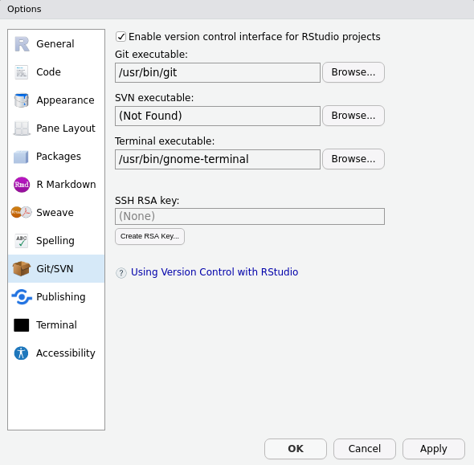
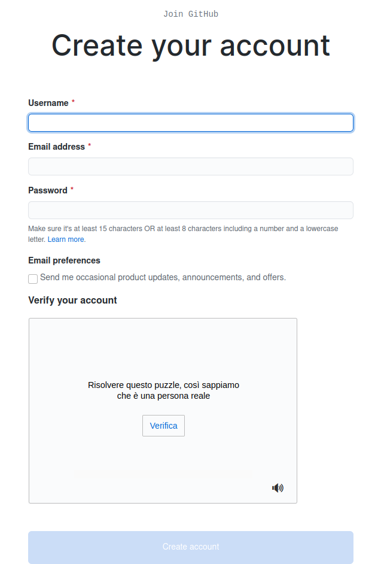

# Getting started with R, RStudio, git and GitHub

#### Matteo Pedone

This document is a guide to set up R, RStudio, git and GitHub on your machines. Please go through the procedures before the lessons we will dedicate to these tools for reproducible statistical analysis.

R is a *free* and *open source* software environment for statistical computing and graphics. It compiles and runs on a wide variety of UNIX platforms, Windows and MacOS. 

RStudio is an integrated development environment (IDE) for R. It includes a console, syntax-highlighting editor that supports direct code execution, as well as tools for plotting, history, debugging and workspace management.

Git is a *free* and *open source* distributed version control system. It has many functionalities and was originally geared towards software development and production environment. In fact, Git was initially designed and developed in 2005 by Linux kernel developers (including Linus Torvalds) to track the development of the Linux kernel. [Here](https://youtu.be/4XpnKHJAok8) is a fun video of Linus Torvalds talking about Git to Google.

Git can be enabled on a specific folder/directory on your file system to version files within that directory (including sub-directories). In git (and other version control systems) terms, this "tracked folder" is called a repository (which formally is a specific data structure storing versioning information).

Although there many ways to start a new repository, [GitHub](https://github.com/) (or any other cloud solutions, such as [GitLab](https://about.gitlab.com/) provide among the most convenient way of starting a repository.

**git is not GitHub** (and vice versa)

* *git*: version control software used to track files in a folder (a repository). git creates the versioned history of a repository
* *GitHub*: web site that allows users to store their git repositories and share them with others
GitHub is a company that hosts git repositories online and provides several collaboration features (among which forking). GitHub fosters a great user community and has built a nice web interface to git, also adding great visualization/rendering capacities of your data.


What you should be able to do with this document is:

1. to [install R and RStudio](#install-r-and-rstudio)
2. to [setup git](#git-setup) on your machine
3. to [link git and RStudio](#link-git-and-rstudio)
4. to [create an account](#create-your-github-account) on GitHub

Whether you experience difficulties or you have any questions regarding these few points, please contact me at `matteo[dot]pedone[at]unifi[dot]it`. 


## Install R and RStudio

####  Mac Users

##### R 

* Open an internet browser and go to [www.r-project.org](https://www.r-project.org)
* Click the `download R` link in the middle of the page under `Getting Started`
* Select a CRAN location (a mirror site) and click the corresponding link
* Click on the `Download R for (Mac) OS X` link at the top of the page
* Click on the file containing the latest version of R under `Latest release`
* Save the `.pkg` file, double-click it to open, and follow the installation instructions
* Now that `R` is installed, you need to download and install `RStudio`

##### RStudio

* Go to [www.rstudio.com](https://rstudio.com/products/rstudio/download/#download) and download the free `RStudio Desktop` Open Source License for `macOS 10.13+` 
* Click on `RStudio-1.4.1106.dmg`, save the `.dmg` file on your computer, double-click it to open, and then drag and drop it to your applications folder

####  Windows Users

##### R 

* Open an internet browser and go to [www.r-project.org](https://www.r-project.org)
* Click the `download R` link in the middle of the page under `Getting Started`
* Select a CRAN location (a mirror site) and click the corresponding link
* Click on the `Download R for Windows` link at the top of the page
* Click on the `install R for the first time` link at the top of the page
* Click `Download R 4.0.4 for Windows` and save the executable file somewhere on your computer
* Run the `.exe` file and follow the installation instructions.  
* Now that `R` is installed, you need to download and install RStudio. 

##### RStudio

* Go to [www.rstudio.com](https://rstudio.com/products/rstudio/download/#download) and download the free `RStudio Desktop` Open Source License for `Windows 10/8/7` 
* Click on `RStudio-1.4.1106.exe`, save the `.exe` file on your computer
* Run the `.exe` file and follow the installation instructions.

####  Linux Users

First of all good call! The following instructions are for `Ubuntu 18.04/20.04`. If you use any other distro, please choose the link that fits you best [here](https://rstudio.com/products/rstudio/download/#download)

##### R 
Open the terminal (`Ctrl+Alt+T`) and type the following commands.
```
sudo apt update
sudo apt-get install r-base
```

##### RStudio
```
wget https://download1.rstudio.org/desktop/bionic/amd64/rstudio-1.4.1106-amd64.deb
```
Since this package has some extra dependencies that you probably don't have installed, you can use `gdebi` to install it. If you do not have `gdebi` installed, you can use the following command:
```
sudo apt install gdebi-core
```
Once installed, now you do install `RStudio` on `Ubuntu 18.04` with the following command:
```
sudo gdebi rstudio-1.4.1106-amd64.deb
```

## Git Setup

MacOSX and Linux computers all come with git pre-installed, but it is not always directly usable. The best way to test if git is ready to use is at the command line:
```
git --version
## git version 2.25.1
```
It should return something like above. If you get an error, you will have to install git

Windows users will have to install a software called `git bash` before being able to use git

#### Mac OS Users
You can download a copy of git [here](https://git-scm.com/downloads) and follow the **carefully** instructions.

Depending on the version, you might have to run a few commands from the terminal. Please refer to the `README.txt` that comes with the download regarding the exact steps to follow.

#### Windows Users
You can download a copy of git [here](https://git-scm.com/downloads) and follow **carefully** the instructions.

You can keep the options to default during the installation, until you reach `Configuring the terminal emulator to use with Git Bash`  **be sure** `Use MinTTY` **is selected**. This will install both git and a set of useful command-line tools using a trimmed down Bash shell.

#### Linux Users

You can download a copy of git [here](https://git-scm.com/downloads) and follow **carefully** the instructions.

#### Setting up your git identity
Before you start using `git` on any computer, you will have to set your identity on your system, as every snapshot of files is associated with the user whom implemented the modifications to the file(s).

Open the `Terminal` or `git bash` and then type the following commands.

Your name and email:

```
git config --global user.name [your full name]
git config --global user.email [your email]
```

##### Optional
Check that everything is correct, modify everything at the same time, set your text editor (respectively):

```
git config --global --list
git config --global --edit
git config --system core.editor atom
```

Here [atom](https://atom.io/) is used as example; you can choose most of the text editor you might have installed on your computer (nano, sublime, notepad++, ...).

## Link git and RStudio

In most of the cases, RStudio should automatically detect git when it is installed on your computer. The best way to check this is to go to the `Tools menu -> Global Options` and click on `git/SVN`

If git is properly setup, the window should look like this:



Click `OK`.

Note: if git was not enabled, you might be asked to restart RStudio to enable it.

## Create your GitHub Account

If you don't have a GitHub Account, please go to [github.com](https://github.com/), hit the `Sign up` button in top right corner, or hit the green `Sign up for GitHub` in the middle of the page.
They will both redirect you to this page:




**I strongly suggest you to use the same email address you used for git configuration while [setting up git](#setting-up-your-git-identity)!**


Fill the form and create your account!

